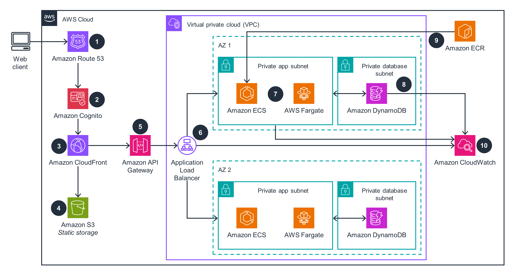

# Containerized and Scalable Web Application

A containerized and scalable web application built on AWS using a serverless-first architecture. The app serves static content via CloudFront + S3, dynamic APIs through API Gateway → ALB → ECS Fargate → DynamoDB, and leverages automated CI/CD with GitHub Actions and OIDC. It’s designed for high availability, performance, security, and full observability.


## What I Built, Why I Built It, and What Problem It Solves
### What I Built
A containerized, scalable web application on AWS using a serverless-first architecture.  
- Static content served via CloudFront + S3  
- Dynamic APIs routed through API Gateway → ALB → ECS Fargate → DynamoDB  
- CI/CD automated with GitHub Actions using OIDC  
- High availability, security, and observability built in from the ground up  

### Why I Built It
To create a secure, high-performance, fully automated cloud-native web application that:  
- Scales reliably across multiple Availability Zones  
- Reduces operational overhead  
- Demonstrates modern AWS best practices including serverless edge delivery, containerized workloads, and Infrastructure as Code  

### Problems It Solved
- **Performance:** Static TTFB ~140 ms; dynamic API latency ~290 ms  
- **Security:** Eliminated public S3 exposure; JWT auth via Cognito; OIDC-based CI/CD avoids long-lived AWS credentials  
- **Availability & Scalability:** Multi-AZ ECS Fargate behind ALB with zero unhealthy targets; serverless-first design allows independent scaling  
- **Infrastructure Safety:** Terraform state bootstrapping with DynamoDB locks prevents concurrent apply conflicts  
- **Developer Efficiency:** One-click deployments via GitHub Actions → ECR → ECS; images referenced by commit SHA and verified by digest  
- **Observability:** Centralized logging, dashboards, and alarms for ECS, ALB, and API Gateway  
- **Edge Caching:** CloudFront X-Cache hits improve repeat visitor page load times  
- **Custom Domain & HTTPS:** ACM + Route 53 automates certificate management and secure domains

## Overview

* Custom domain with HTTPS (ACM + Route 53)
* Cognito for user authentication
* Static content via S3 → CloudFront
* Dynamic API `/api/*` via API Gateway → ALB → ECS/Fargate
* Data in DynamoDB, images in ECR
* Logs, alarms, dashboard in CloudWatch

## Architecture

[](images/containerized-and-scalable-web-application.png)

## Repo

```
bootstrap-backend/  # S3 tfstate + DynamoDB lock (one‑time)
images              # architecture 
infrastructure/     # Terraform root (uses ../modules/*)
modules/            # network, acm, route53, s3_static, cloudfront, apigw,
                    # alb, ecs, ecr, dynamodb_app, cognito, cloudwatch, iam_github_oidc
app/                # Node/Express sample (port 3000)
.github/workflows/  # build-and-deploy.yml
```

## Prereqs

* Region: us‑east‑1. Route 53 hosted zone for your domain.
* Terraform ≥ 1.6, AWS provider ≥ 5.x, Docker, GitHub Actions enabled.

## Setup

1. **Bootstrap state**

```bash
cd bootstrap-backend && terraform init && terraform apply \
  -var 'region=us-east-1' \
  -var 'state_bucket_name=<unique-bucket>' \
  -var 'lock_table_name=tfstate-locks'
```

Update `infrastructure/backend.tf` with bucket + table.

2. **Configure vars** — edit and commit `infra/terraform.tfvars`.

3. **First apply**

```bash
cd infrastructure && terraform init -reconfigure && terraform apply -auto-approve
```

Capture `iam_ci_role_arn` and `ecr_repo_url` outputs.

## CI/CD (GitHub Actions)

* Secret: `AWS_GITHUB_ROLE_ARN` = output `iam_ci_role_arn`
* Variable: `ECR_REPO_NAME` = your repo name (e.g., `webapp`)
  Push to `main` → build to ECR (tag = commit SHA) → `terraform apply` with `TF_VAR_image_tag`.

## App

* Health: `/` → 200 for ALB
* API: `/api/health`, `/api/items` (GET/POST)
* Env: `TABLE_NAME` set in ECS task

## Observability

* Logs: `/ecs/webapp`, `/apigw/<api>`
* Dashboard: `app-observability`
* Alarms: ECS CPU, ALB 5XX, API 5XX (optional SNS email)

## Useful

```bash
# Upload static site
aws s3 sync ./static s3://static-<example-com>/ --delete

# Test API
curl -i https://<domain>/api/health
```

## Cleanup

```bash
cd infrastructure && terraform destroy -auto-approve
cd ../bootstrap-backend && terraform destroy -auto-approve
```
